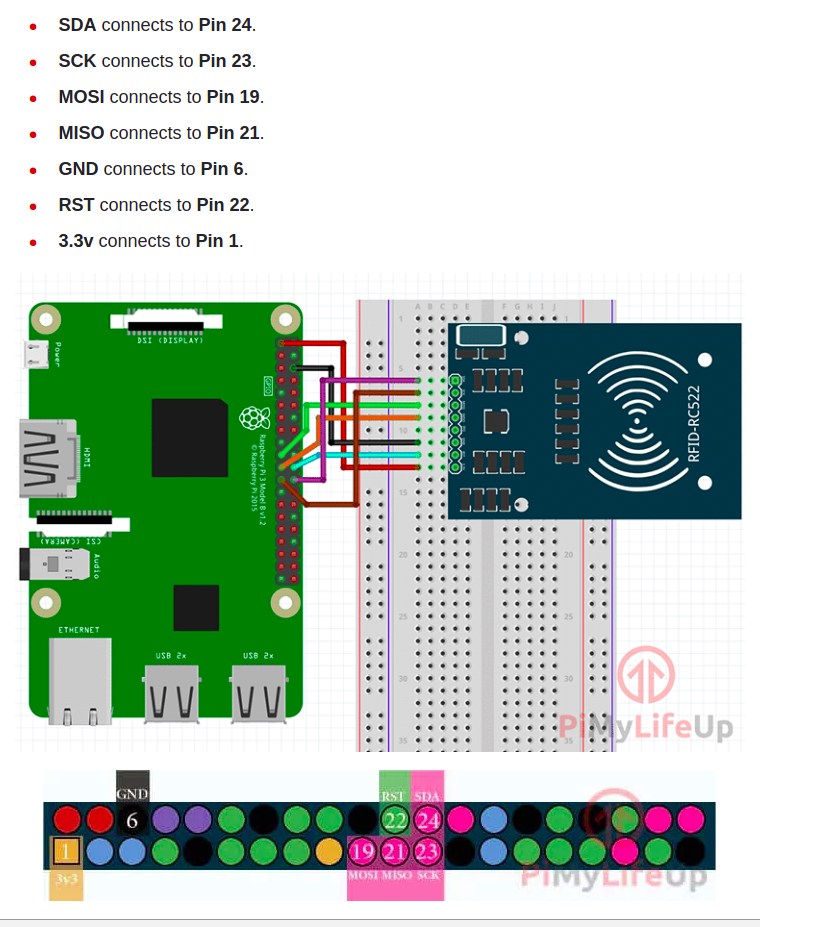

# Army-Attendence-System-HackTheBuild-2.0

This repo contains all the necessary codes and instruction that need to setup the attendence system for an upfront army location. This project is made for the Hackathon HackTheBuild 2.0 organised by IIT JAMMU(2021).

<br>
<hr> 

## Problem Statement
Create an attendance system for the defense, without using a database, through the use of other technologies. It should be an offline system, with only one online registration.

## Our Solution / Product Description

Our product is both hardware and software based solution. Here we are using Raspberry pi as our main computing system which uses RFID-RC522 sensor to mark attendences of Army Personels. Here we are using RFID cards for identifying each person i.e. the each individual have their own RFID cards that are responsible for marking your daily attendences. 
<br>
The attendence will then be saved both on user's RFID card offline and on raspberry pi server for future records and backup purposes. The offline daily attendences will be marked on each individual daily on their RFID cards. 
Each RFID cards have some memory limit to store the data so here for now <I>we are keeping the data for only 1 month as a buffer in each cards local storage.
</I>
<br>
Each user can request the system to show his/her attendence by using its card and our system in offline mode, while the admin can see the attendences for all registered Users/personels by using the saved attendences from database.

> Here we are storing the attendence data in our backend just for emergency purposes, just in case if user losts his/her card then also their attendences can be seen. On in future if admin wants to see who is most regular individual then he can see from using his/her previous records. 

> The offline attendences of each individual is marked on individuals card too in 1 month buffer time. In starting of each month user's data will be backed up in server and new months data will then be recorded. 

## **Benifits in Using our System**

- Admin portal for monitoring attendences of every personel.
- Low Cost in setting up the full system.
- Quick Response for recording attendences.
- Easy to use and low maintainance.
- Effectively size optimised, you can carry in your handbag.
- Highly Portable, can be used in upfront army areas. 
- Very friendly UI, anyone can use our system without any extra guidance.
- Easy to carry physical attendence card or keyring cards. 
- Low Enerygy requirement, can be powered up using only powerbank.

<br>
<hr> 
<br>

## Features of Our System.


<br>
<hr> 
<br>

# Installation

The installation process will contain two parts: Hardware and Software. 
- ## Hardware Setup:-
    One time Installation is Required for setting up Hardware Interfaces.s
    * #### Required Hardware Components:-
        - Raspberry pi
        - RFID-RFC522 RFID sensor module.
        - Connecting Wires. 
        - Powerbank for giving power.
        - Display **(NOT NECESSARY)**.
        - HDMI Cable **(NOT NECESSARY)**.

    * #### Instal Raspbian in Raspberry pi 
        > Guiide link:- https://linuxize.com/post/how-to-install-raspbian-on-raspberry-pi/

    * #### Connect the Module and raspbian's GPIO pins as shown in image.
        

    * #### Get a Powerbank for powering on the system.

## Software Setup

    - Open the Terminal using `Alt+Ctrl+T` shortcut, or by right clicking on desktop of raspian clicking on open terminal option. 

    - Now change the active directory to Desktop.
        ```
        $ cd ~/Desktop
        ```
    
    - Now Clone this repo.
        ```
        $ git clone https://github.com/abhyamgupta123/Army-Attendence-System-HackTheBuild-2.0-.git
        ```

    - Now change the active directory to our folder
        ```
        $ cd Army-Attendence-System-HackTheBuild-2.0-
        ```

    - Install all the dependencies using.
        ```
        $ sudo apt-get install python3-dev python3-pip
        ```

    - Now make an Virtual enviornemnt to keep our installed modules safe.
        ```
        $ python2.7 -m venv venv
        $ source venv/bin/activate
        ```

    - Now install all the python packages by using running command.
        ```
        $ python3.7 -m pip install -r requirements.txt
        ```

    - Now turn on the server using.
        ```
        $ python3.7 manage.py runserver 0.0.0.0:8000
        ```

    


